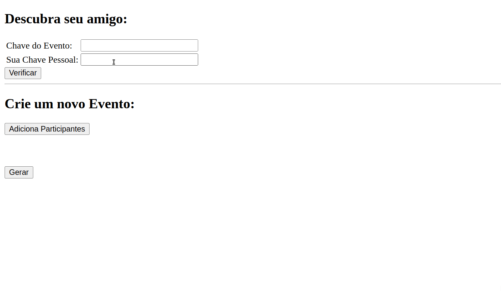

# amigosecreto

Projeto desenvolvido por Igor Ávila Pereira que automatiza o sorteio de nomes para o tradicional jogo de amigo secreto.
A aplicação foi desenvolvida em PHP com uma interface HTML simples, permitindo o uso direto pelo navegador.

## Demo

### 🔧 Funcionalidades Principais

* **Sorteio automatizado**: Realiza automaticamente o sorteio entre os participantes.
* **Interface web leve**: Interface simples e intuitiva, acessível via navegador.
* **Validação de participantes**: Scripts para garantir que os dados estejam corretos antes do sorteio.
* **Demonstração visual**: Um GIF (`demo.gif`) mostra como a aplicação funciona em tempo real.

### 🧪 Tecnologias Utilizadas

* **HTML**: Criação da interface visual da aplicação.
* **PHP**: Lógica do back-end para processar, validar e gerar os sorteios.
* **JavaScript (mínimo)**: Pode ser usado para interação ou verificação no lado do cliente (embora pouco presente neste projeto).
* **CSS (inline ou básico)**: Estilização da interface HTML.
* **000webhost**: Hospedagem gratuita usada para demonstrar o projeto online.

### 🌐 Demonstração Online

A aplicação pode ser testada em:

👉 [https://amigosecretoigor.000webhostapp.com](https://amigosecretoigor.000webhostapp.com)

> Nota: Por estar hospedado em um serviço gratuito, o site pode apresentar lentidão ou indisponibilidade ocasional.

### 📁 Estrutura do Repositório

* `index.html`: Página inicial da aplicação.
* `gerar.php`: Script que executa o sorteio.
* `validade.php`: Verifica os dados enviados pelos participantes.
* `verificar.php`: Confirma os pares sorteados.
* `demo.gif`: Exemplo visual do funcionamento da aplicação.
* `README.md`: Instruções e descrição do projeto.

### 🎯 Público-Alvo

Ideal para grupos que querem organizar rapidamente um amigo secreto, seja entre amigos, colegas ou familiares.
Dispensa cadastros ou sistemas complexos — basta acessar, inserir os nomes e sortear.
